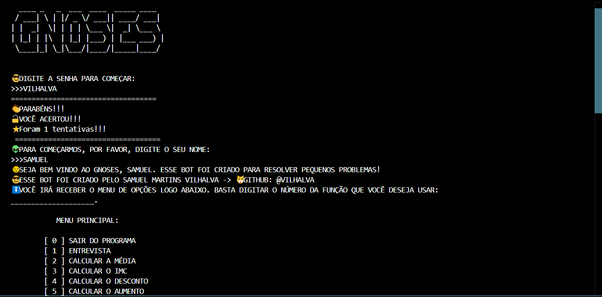
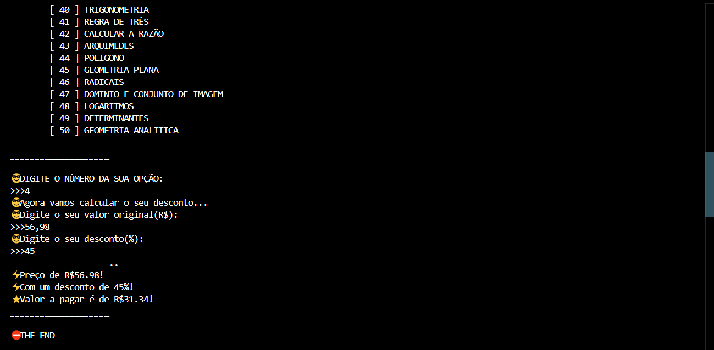

# GNOSES
👨‍💻GNOSES É UM CHATBOT DE CALCULOS QUE RODA NO CONSOLE DA IDE.

 <br>
 <br>

## DESCRIÇÃO:
O bot é um programa em Python que oferece uma variedade de funcionalidades interativas em um menu. Para acessar o menu, o usuário precisa fornecer uma senha correta (`VILHALVA`). Uma vez dentro, o usuário pode escolher entre diferentes opções numeradas para realizar várias tarefas, como entrevista, cálculos matemáticos, conversões, etc. Cada opção representa uma funcionalidade específica e executa uma tarefa diferente. O bot utiliza recursos visuais, como estilos de texto, para tornar a interação mais interessante. Além disso, inclui mensagens de espera e contagens regressivas para criar uma experiência mais envolvente. 

## EXECUTANDO O PROJETO:
1. **Instalar as dependências**:
   - Antes de rodar o bot, é essencial garantir que todas as dependências estejam instaladas. No terminal, navegue até o diretório `CODIGO` e execute o seguinte comando para instalar os pacotes listados no arquivo `requirements.txt`:
     ```bash
     pip install -r requirements.txt
     ```

2. **Executar o bot**:
   - Ainda no diretório `CODIGO`, inicie o bot com o seguinte comando:
     ```bash
     python main.py
     ```

3. **Digite a Senha e Seu Nome:**
   - Para liberar o acesso, insira a seguinte senha ao iniciar:
     ```
     VILHALVA
     ```
   - Após digitar a senha, o sistema solicitará que você insira seu nome. Aguarde enquanto o `Menu Principal` é carregado.

4. **Menu principal**:
   - O bot abrirá o menu principal diretamente no console. Leia atentamente as opções disponíveis.

5. **Escolher uma opção**:
   - Digite o número correspondente à opção desejada e pressione `Enter`. O bot executará a função associada à escolha.

6. **Interação com o usuário**:
   - Dependendo da opção escolhida, o bot realizará cálculos e gerará resultados com base nas informações fornecidas.

7. **Navegar no menu**:
   - Após executar uma função, o bot retornará automaticamente ao menu principal. A partir daí, você pode continuar explorando outras opções ou sair.

8. **Encerrar o bot**:
   - Quando quiser finalizar a sessão, basta digitar `0` no menu principal. Isso encerrará o bot de maneira segura.

## NÃO SABE?
- Entendemos que para manipular arquivos em muitas linguagens e tecnologias, é necessário possuir conhecimento nessas áreas. Para auxiliar nesse aprendizado, oferecemos cursos gratuitos disponíveis:
* [CURSO DE PYTHON](https://github.com/VILHALVA/CURSO-DE-PYTHON)
* [CONFIRA MAIS CURSOS](https://github.com/VILHALVA?tab=repositories&q=+topic:CURSO)

## CREDITOS E MAIS:
- [PROJETO CRIADO PELO VILHALVA](https://github.com/VILHALVA)
- [CLIQUE AQUI PARA VER O HISTÓRICO DE ATUALIZAÇÕES](./UPDATES.md)


