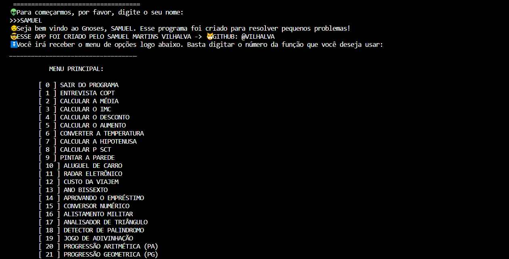

# GNOSES
👨‍💻GNOSES É UM APP DE CHATBOT DE CALCULOS QUE RODA NO CONSOLE DA IDE.

  

## DESCRIÇÃO:
O aplicativo é um programa em Python que oferece uma variedade de funcionalidades interativas em um menu. Para acessar o menu, o usuário precisa fornecer uma senha correta (`VILHALVA`). Uma vez dentro, o usuário pode escolher entre diferentes opções numeradas para realizar várias tarefas, como entrevistas de emprego simuladas, cálculos matemáticos, conversões, etc. Cada opção representa uma funcionalidade específica e executa uma tarefa diferente. O programa utiliza recursos visuais, como estilos de texto, para tornar a interação mais interessante. Além disso, inclui mensagens de espera e contagens regressivas para criar uma experiência mais envolvente. 

## EXECUTANDO O PROJETO:
1. Certifique-se de que todos os arquivos de código fonte listados no início do `CODIGO/MAIN.py` estão presentes no mesmo diretório que o arquivo `MAIN.py`.
2. Execute o arquivo `CODIGO/MAIN.py` em um ambiente Python.
3. Isso abrirá o menu principal do programa no console.
4. Leia as opções do menu e escolha a opção desejada digitando o número correspondente.
5. O programa executará a função associada à opção escolhida.
6. Dependendo da opção escolhida, o programa pode solicitar informações adicionais ou realizar cálculos com base nas entradas do usuário.
7. Após a execução da opção escolhida, o programa retornará ao menu principal, onde você pode escolher outra opção ou sair do programa digitando `0`.
8. Quando terminar de usar o programa, escolha a opção `0` para sair.

## SOBRE O EXECUTAVEL:
- Este arquivo executável está disponível apenas para `Windows X64` (No diretório `APP`). Para executá-lo, basta dar dois cliques. O executável é bastante útil caso o Python não esteja instalado. Trata-se da mesma aplicação do arquivo `MAIN.py`. Se desejar, você pode recompilá-lo novamente; é para isso que forneci o arquivo `imagem.ico`.

## NÃO SABE?
- Entendemos que para manipular arquivos em muitas linguagens e tecnologias, é necessário possuir conhecimento nessas áreas. Para auxiliar nesse aprendizado, oferecemos cursos gratuitos disponíveis:
* [CURSO DE PYTHON](https://github.com/VILHALVA/CURSO-DE-PYTHON)
* [CURSO DE TKINTER](https://github.com/VILHALVA/CURSO-DE-TKINTER)
* [CURSO DE EXE](https://github.com/VILHALVA/CURSO-DE-EXE)
* [CONFIRA MAIS CURSOS](https://github.com/VILHALVA?tab=repositories&q=+topic:CURSO)

## CREDITOS E MAIS:
- [PROJETO CRIADO PELO VILHALVA](https://github.com/VILHALVA)
- [CLIQUE AQUI PARA VER O HISTÓRICO DE ATUALIZAÇÕES](./UPDATES.md)

